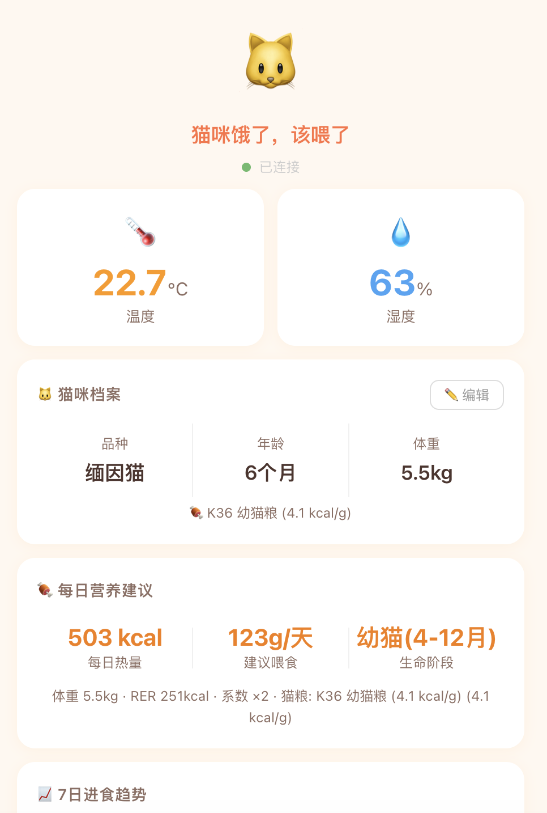

<h1 align="center">🐱 MeowBoard · 猫咪仪表盘</h1> 

 <p align="center"> 
   米家智能宠物喂食器 Web 控制台<br> 
   漂亮、贴心、专业的猫咪喂养看板 
 </p> 

 <p align="center"> 
    
    
    
    
 </p> 

***

## ✨ 功能

| 模块            | 说明                                |
| ------------- | --------------------------------- |
| 🐱 **猫咪档案**   | 品种、年龄、体重，页面实时编辑                   |
| 🌡️ **环境监测**  | 温度、湿度（米家温湿度计）                     |
| 🍽️ **智能饱食度** | 综合设备进食克数 × 时间衰减，真实反映猫咪状态          |
| 🍖 **营养建议**   | 根据体重/年龄/阶段自动计算每日热量和喂食克数           |
| 🏪 **猫粮数据库**  | 收录 12 个品牌 50+ 款主流猫粮，精确到 kcal/g    |
| ⏰ **喂食计划**    | 读取设备定时计划，区分自动/手动出粮                |
| 📋 **每日记录**   | 今日全部喂食记录，自动统计                     |
| 🌐 **外网访问**   | 配合 ngrok/Cloudflare Tunnel 即可公网访问 |
| 📱 **移动端优化**  | 暖色糖果风，手机/平板完美适配                   |

## 🖼️ 截图



## 🚀 快速开始

### 1. 环境要求

- Python 3.12+
- 米家智能宠物喂食器 2
- （可选）米家温湿度计 3

### 2. 安装

```bash
cd xiaomifeeder 

# 创建虚拟环境 
python3 -m venv .venv 
source .venv/bin/activate 

# 安装依赖 
pip install -r requirements.txt 
```

### 3. 获取设备凭证

在浏览器中登录 `https://account.xiaomi.com` ，完成身份验证后：

1. `F12` → Application → Cookies → `account.xiaomi.com`
2. 复制 `userId` 和 `passToken` 的值

### 4. 配置

```bash
cp .env.example .env 
```

编辑 `.env`：

```bash
# 方式1（推荐）：passToken 登录，无需密码 
MI_USER_ID=你的userId 
MI_PASS_TOKEN=你的passToken 

# 方式2：账号密码登录 
# MI_USER=你的手机号 
# MI_PASS=你的密码 

# 设备 DID 
FEEDER_DID=你的喂食器DID 
SENSOR_DID=你的传感器DID 
```

### 5. 启动

```bash
python run.py 
```

浏览器打开 `http://localhost:8080`

## 📡 外网访问

### ngrok（推荐）

```bash
brew install ngrok 
ngrok http 8080 
# 获得 `https://xxx.ngrok-free.app` 
```

### Cloudflare Tunnel

```bash
brew install cloudflared 
cloudflared tunnel --url http://localhost:8080 
# 获得 `https://xxx.trycloudflare.com` 
```

## 📁 项目结构

```
xiaomifeeder/ 
├── run.py                  # 启动入口 
├── requirements.txt 
├── .env.example            # 配置模板 
├── app/ 
│   ├── main.py             # FastAPI 路由 + 仪表盘 API 
│   ├── cloud.py            # 小米云服务客户端 
│   ├── feeder.py           # 喂食器控制器 
│   ├── sensor.py           # 温湿度传感器 
│   ├── feed_history.py     # 喂食历史 + 饱食度算法 
│   ├── cat_profile.py      # 猫咪档案 
│   ├── nutrition.py        # 营养计算器 (RER/DER) 
│   ├── food_db.py          # 猫粮品牌数据库 
│   ├── templates/ 
│   │   └── dashboard.html  # 仪表盘页面 
│   └── static/ 
│       └── dashboard.css   # 样式 
├── feed_history.json       # 喂食记录（自动生成） 
├── cat_profile.json        # 猫咪档案（自动生成） 
└── README.md 
```

## 🔧 API

| 端点                     | 方法       | 说明                     |
| ---------------------- | -------- | ---------------------- |
| `/`                    | GET      | 仪表盘页面                  |
| `/api/dashboard`       | GET      | 聚合数据（设备+温湿度+饱食度+营养+档案） |
| `/api/feed?portions=N` | POST     | 手动出粮                   |
| `/api/cat`             | GET/POST | 猫咪档案读写                 |
| `/api/nutrition`       | GET      | 营养计算                   |
| `/api/foods/brands`    | GET      | 猫粮品牌列表                 |
| `/api/foods?brand=皇家`  | GET      | 品牌旗下产品                 |
| `/api/health`          | GET      | 健康检查                   |

## 🧠 营养算法

```
RER = 70 × 体重(kg)^0.75 
DER = RER × 生命阶段系数 
每日克数 = DER ÷ 猫粮热量密度(kcal/g) 
```

| 阶段       | 系数   |
| -------- | ---- |
| 幼猫 0-4月  | ×2.5 |
| 幼猫 4-12月 | ×2.0 |
| 青年 1-2岁  | ×1.4 |
| 成年 2-8岁  | ×1.2 |
| 老年 8岁+   | ×1.1 |

## ⚠️ 注意事项

- 首次登录可能需要浏览器完成身份验证，推荐使用 `passToken` 方式
- 请勿频繁调用出粮接口，避免设备异常
- 猫粮数据库的热量值来源于各品牌官方数据，仅供参考

***

 <p align="center"> 
   <sub>Made with 🐾 for cat lovers</sub> 
 </p>
